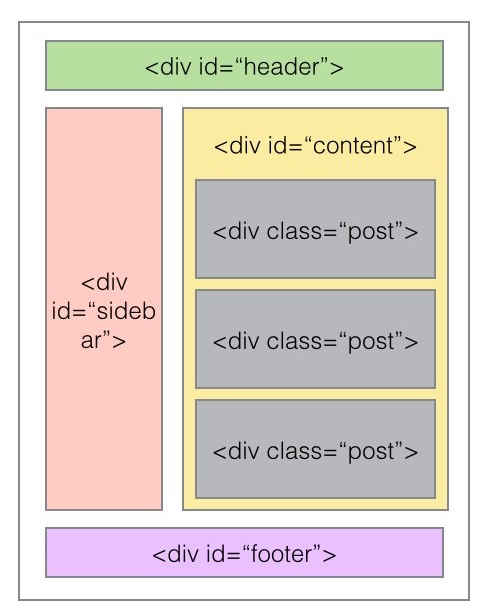
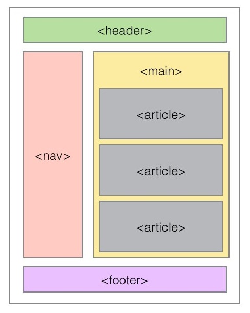
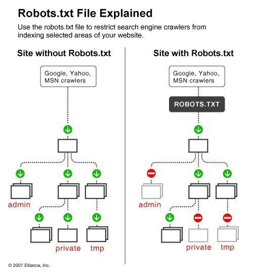

Bu repository içerisinde Search Engine Optimization ile ilgili notlarım ve örnek uygulamalarım yer alıyor.

# Giriş
Semantik web programlamada kullanılan etiketlerin anlamlı olmalarıdır böylece arama motorları siteye baktığında sitede ne olduğu ve içeriği konusunda anlamlı bir bilgi edinir.

|Semantik etiket| Açıklama|
|---|---|
|article|bağımsız içerikleri ve makaleleri tanımlar|
|aside|kenar çubuklarını tanımlar|
|details|ek ayrıntıları tanımlar|
|figure|görsel içeriği tanımlar|
|figcaption|görsel içeriğin başlığını tanımlar|
|footer|sayfa için alt bilgiyi tanımlar|
|header|sayfa için başlık tanımlar|
|hgroup|başlık grubunu tanımlar|
|nav|sayfadaki bağlantıları ve menüyü tanımlar|
|mark|işaretlenmiş içeriği tanımlar|
|section|sayfa içindeki bir bölümü tanımlar|
|summary|özet içeriği tanımlar|
|time|oluşturulma zamanını tanımlar|
|main|sayfa içeriğinin ana kökünü belirtir.|




- **article**
    içeriği içindeki etiketleri işyerek olduğu gibi gösterir.
    ```html
    <article>
        <h1>makale</h1>
        <p>makale içeriği</p>
    </article>
    ```
- **aside**
    içeriği içindeki etiketleri işyerek olduğu gibi gösterir.
    ```html
    <aside>
        <h1>makale</h1>
        <p>makale içeriği</p>
    </aside>
    ```
- **detail**
    içeriği gizler ve tıklanabilir bir akordeon menü haline getirir
    ```html
    <details>
        <p>details etiketi özelliği</p>
    </details>
    ```
- **figure**
    içinde resim gösterilir içindek img etiketi kullanılır
    ```html
    <figure>
        
    </figure>
    ```
    <figure>
        
    </figure>
- **figcaption**
    içinde resim gösterilir içindek img etiketi kullanılır
    ```html
    <figure>
        <figcaption>yaz manzarası</figcaption>
        
    </figure>
    ```
    <figure>
        <figcaption>yaz manzarası</figcaption>
        
    </figure>
- **footer**
    içinde resim gösterilir içindek img etiketi kullanılır
    ```html
    <footer>
        <p>sayfayı hazırlayan kişinin adı</p>
    </footer>
    ```
- **header**
    başlık grubudur.bir başlık yazılması gerekiyorsa bu başlık içerisine yazılmalıdır.
    ```html
    <article>
        <header>
            <h1>başlık</h1>
            <p>paragraf 1</p>
            <p>paragraf 2</p>
        </header>
    </article>
    ```
**hgroup**
    header ile aynı mantıkta çalışmaktadır.
**mark**
    işaretlenmiş yazıları belirtir.
    zemin rengini sarı yapar.
```html
<p>bu paragrafta <mark>işaretlenmiş</mark> kelime var </p>
```
**nav**
    menüleri,butonları ve bağlantıları içeren etiket grubudur.
```html
<nav>
    <div style="background-color:silver; padding:5px;">
        <a href="/sayfa1.html">sayfa 1</a>
        <a href="/sayfa2.html">sayfa 2</a>
    </div>
</nav>
```
**section**
    bölüm kesiti anlamındadır bir yazının bir parçasını göstermek için kullanılabilir.
```html
<section>
    <h3>başlık</h3>
    <p>burası bir paragraftır.</p>
    <p>bu paragrafı yazan kişinin adıdır.</p>
</section>
```
**summary**
bir içeriğin özetini göstermekte kullanılır tıklandığında devamını gösterir.details etiketi ile birlikte kullanılır.
```html
<details>
    <summary>&copy; Copyright</summary>
    <p>bu sayfadaki içerikler tefif hakkı ile korunmaktadır.</p>
</details>
```
> <details><summary>&copy; Copyright</summary><p>bu sayfadaki içerikler tefif hakkı ile korunmaktadır.</p> </details>

**time**
    zaman tanımlamaları yaparken kullanılır.
```html
<time>makalenin yazılma tarihi</time>
```

**Offline cache -manifest hazırlamak**
önbelleklenecek sayfayı belirtme
html etiketinde manifest adında bir attribute tanımlamaktır, tanımlanan manifesto dosya okuma durumlarını belirtecek olan **.appcache** uzantılı dosya ismi yazılır.

HTML5 Cache Manifest dosya biçimini kullanarak web uygulamalarının çevrimdışı çalışmasını sağlayan bir dosyadır.
Bu dosya biçiminde, CACHE MANIFEST başlığı ile başlayan ve .appcache uzantılı bir dosya oluşturmanız gerekir.
Bu dosyada, cache lenmesini istediğiniz dosyaları CACHE bölümüne, her zaman yeniden yüklenmesini istediğiniz dosyaları NETWORK bölümüne ve cache lenemeyen dosyalar için alternatif dosyaları FALLBACK bölümüne yazabilirsiniz.
Örneğin, aşağıdaki gibi bir index_manifest.apache dosyası oluşturabilirsiniz:
```html
<html manifest="index_manifest.appcache">
```
bu tanımlamada index_onbellek.appcache adlı bir dosyayı okumasını ve önbellek durumuna bakmasını belirtmiş olduk.

**Örnek bir cache dosyası içeriği**
```apache
CACHE MANIFEST
# Bu bir yorum satırıdır

CACHE:
index.html
stylesheet.css
images/logo.png
scripts/main.js

NETWORK:
http://cdn.example.com/scripts/main.js

FALLBACK:
/images/ /images/offline.png
```
# Seo Nedir 
Seo arama motoru optimizasyonudur. Web sayfalarını arama motorları için optimize etmek demektir.Optimizasyon ile arama motorları web sayfanız içinde yer alan içerikleri daha iyi tarayıp indexleyebilir arama motorları sayfanızı ne kadar kolay bir şekilde analiz edebilirse sıralamada üst sıralara doğru çeker.

## Temiz ve doğru kod yazımı

**yanlış örnek**
```html
<i><b>yanlış</i></b>
```
**doğru örnek**
```html
<i><b>doğru</b></i>
```
web sitesi hazırlandıktan sonra <a href="https://validator.w3.org">https://validator.w3.org</a> adresinden kodlar kontrol edilmelidir.

## Script dosyalarını dışarıda tutmak
Arama motorlarının sayfaları daha kolay yorumlayabilmesi için bir web sayfasında css ve scriptlerin dışarıda tutulması gereklidir. Bu şekilde sayfalar daha hızlı yüklenir.Gereksiz etiket kullanılmaması gereklidir.olabildiğince az ve sade bir kod yapısından oluşmalıdır.

## Sayfa yükleme boyutunu en aza çekme
Kullanılan resimlerin formatları jpg ve png formatlarında olmalıdır.Görseller 72 dpi'dan falza olmamalıdır.(Web standardı 72 dpi dır.)Portre tablo gibi aşırı büyük ölçülerde resim kullanılmamalıdır.Resimlerin optimizasyonu için online image optimizer lar kullanılabilir.

## Hiyerarşik başlık (h1...h6) etiketleri
Bu kuralda bahsedilen etiketleri hiyerarşik bir yapıda kullanmamızdır.Yapılan site şablonlarında o sayfanın başlığı mutlaka h1 etiketi ile gösterilmelidir.alt kısımlarda ise h2 ile alt başlıklar listelenmelidir.

h1 etiketi sayfa yapısında sadece bir defa kullanılmalıdır. h1 etiketi altında da diğer alt başlıklar kendi hiyerarşik yapıları ile içeriğin biçimine göre değişebilir.ancak çok fazla iç içe başlıkların sıralanması pek de uygun değildir ek olarak h1 etiketi ile <code>title</code> sayfaya tanımlanan başlık ile benzeşmelidir.Arama motoru o sayfaya baktığında title ile altında bulunan h1 başlığın birbirile alakalı içerik bulması gereklidir.**<code>h</code> etiketi içerisinde sadece a etiketi ile link vermek için etiket kullanılabilir diğer etiketlerin h etiketi içerisinde kullanılmaması gereklidir.**

## Arama motorlarını besleyecek şekilde içerik yapılandırması 
Arama motorları sayfayı taradığında içerik bulmak isteyecektir, başlık sisteminde bulacağı içerik ne çok kısa nede çok uzun olmalıdır.çok uzun olan içerikler başlıklar halinde parçalara ayrılmalıdır.

## Masaüstü ve mobil web için favicon sayfa ikonu kullanımı
Web sayfalarında favicon kullanılması gereklidir.ve head etiketleri arasında tanımlanmalıdır.

## Değişken ve doğru bir yapıda oluşturulan sayfa başlığı
arama motorlarının ilk taradığı kısımlardan biride sayfa başlığıdır.web sayfaları programlanırken as <code>title</code> etiketi için sabit bir değer verilmemelidir.Sayfa etiketleri daima içeriğe göre yeniden düzenlenebilir olmalıdır.Ayrıca sayfa başlığı sistemlerine de dikkat edilmelidir. yani gelişi güzel bir şekilde başlık yapılandırılması yapılmamalı.

> sayfa ismi | anahtar kelimeler | firma ismi

veya

> anahtar kelimeler | sayfa ismi | firma ismi

şeklinde olmalıdır.

## Meta etiketleri
Meta etiketleri hem tarayıcılar hemde arama motorları tarafından dikkate alınan bazı bilgileri taşır tarayıcılar sayfaları nasıl görüntüleyeceği tarzında bilgiler edinirken arama motorları da o sayfa hakkında bazı bilgilere erişir bu bilgilerle aramaları buldukları sonuçları ziyaretçilere gösterir.
<code>meta</code> etiketleri <code>head</code> arasında yazılır
```html
<head>
    <!--description arama motorlarında görünen açıklama kısmıdır.Seo açısından en fazla 155 karakter olmalıdır ve mutlaka kullanılmalıdır.-->
    <meta name="description" content="sayfa yazarı | x konudaki uzmanlığı | yazarın mesajı">
    <!--abstract site açıklamasının daha kısa halidir.-->
    <meta name="abstract" content="x kişinin kişişel blog sayfası">
    <!--keywords o sayfayı tanımlayan anahtar kelimelerdir 3 ile 5 arası anahtar kelime kullanın mutlaka kullnılmalıdır.-->
    <meta name="keywords" content="sayfa yazırının adı,becerisi yada pozisyonu 1,becerisi 2">
    <!--google,yahoo ve bing gibi arama hepsine veya bazılarına göre bir tanımlama yapılır genelde osayfanın indexlenmemesi için 404 sayfalarında bu kod şablonu kullanılır.-->
    <meta name="robots" content="noindex,nofallow">
    <!--google için sayfanın indexlenmemesini istedik-->
    <meta name="googlebot" content="noindex">
    <!--sayfaya içerik giren editörün ismi-->
    <meta name="author" content="yazar adı">
    <!--language sayfanın dili <html lang="tr"> şeklindede belirtilebilir-->
    <meta name="language" content="Turkish">
    <!--copyright site ile ilgili copyright bilgisi mutlaka kullanılmalı-->
    <meta name="copyright" content="©2022 siteismi.com">
<head>
```
|yönerge|açıklama|
|---|---|
|all|varsayılan değerdir sayfada ne var ne yksa indexler|
|noindex|sayfayı önbelleğe almayı engeller ve sayfanın bağlatısını engeller|
|nofallow|sayfa bağlantısını izlemeyi engeller|
|none|noindex + nonefallow anlamındadır.|
|noarchive|arama sonuçlarında önbelleğe alınmış içerik gösermesini engeller|
|nosnippet|arama sonuçlarında bu sayfaya ilişkin (varsa) snippet'ı göstermez|
|notranslate|arama sonuçlarında  otomatik olarak açılan sayfayı çevir önerisi kapatılır|
|noimageindex|sayfa içinde yer alan görselleri indexlemez|

## Resimlerin alt etiketi ile tanımlanması
Resim ilişkili olduğu içeriğe göre tanımlanmasıdır arama motorları içerik ile ilgili resim aramalarında <code>img</code> etiketinin **alt** özelliğine bakarlar
```html

```
## Uygun linkler, Link isimleri ve Canonical etiketi
Arama motorları linkleri sadece sayfaları bağlamak için değil o sayfada neler olduğunu tahmin etmek kullanır.
Cms kodlamışsak editörün de link yapılandırmasını doğru bir şekilde yapabilmesi için alt yapıyı hazırlamamız gerekir.

**Doğru ve klasik bir url yapısı bileşenleri aşağıdaki gibi olmalıdır**

```html 
https://kitap.egitim.com/python-programlama/python?id=10
```
Link incelenediğinde ilk olarak subdomain dikkati çeker.Arama motorları ilk olarak domain adında kelimeyi arar,sonra da subdomain'de arar.Eğer aranan kelimeler bu ikisinde varsa ilk o sayfa ilk sıralara çıkar sonra kategori (python-programlama) gelir.Ardında da ziyaretçilerin arayacağını düşündüpümüz anahtar kelime (python) yer alır.

**SELF url'de ise şöyledir;**
```html
https://egitim.com/kitap/python-programlama/
```
bunun daha verimli olanı şu şekildedir.
```html
https://kitap.egitim.com/python-programlama/
```
**Yanlış url yapısıda aşağıdaki gibidir.**
```html
https://server40.egitim.com/12jh4g1234g/i?a=43b5jk%df7g=x76cv3uz1xc8vasdf
```
Birsayfa birden fazla farklı şekilde link bağlantısı yapılmamalıdır.Sayfaya tekbir kesin link verilmelidir, bunuda **canonical(standart)** tanımı ile yapabiliriz

**kopya bağlantı mantığı**
```html
https://www.egitim.com
www.egitim.com
egitim.com/index.php
www.egitim.com/index.php?id=1
```
buradaki dört linkte aynı yere çıkar ama hepsi birbirinden farklıdır.
tercih edilen link şeklide aşağıdaki gibidir.
```html
https://egitim.com/
```
burada com'dan sonra **/** işareti var eğer olmasaydı egitim.com'a gidecek ve oradan egitim.com/ adresine yönlendirilecekti 

**Canonical etiketi ile adres tanımlanması**
<code>head</code> etiketleri arasında tanımlanır.ve böylece sayfanın net adresi belirtilmiş olur.
```html
<head>
    <link ref="canonical" href="https://www.egitim.com">
</head>
```

## Arama Motoru Sonuç Sayfası (SERP) Optimization
SERP **Search Engine Result Page** yani arama motoru sonuç sayfası anlamına gelir.Daha da anlaşılır bir şekilde ifade edersek; arama motorunda bir şey aradığınızda çıkan sonuç sayfasıdır.

Google ve Yandex için bir arama yapıldığında, herhangi bir sonuç için üretilen şablonşu şekildedir.
```html 
Sayfa başlığı (< title >< /title >) - 70 karakter.
Sayfanın bulunduğu URL - 156 karakter.Veya Kısa Link + Breadcrums(Kategori>Alt Kategori>...)>
Güncelleme tarihi (opsiyonel) -< meta name="description" content=""> etiketi verisi
```
**örnek sayfa tanımı**
```html
<head>
    <title> Site-sayfa adı | WEB Developer</title>
    <meta name="description" lang="tr" content="YAZDIĞI ÖZGÜN MAKALELER İLE TANINMIŞTIR VE YENİ ARAŞTIRMALAR YAPARAK İNSANLAR İLE PAYLAŞMAKTAN MUTLULUK DUYMAKTADIR.">
</head>
```
**örnek breadcrumb tanımı**
```html
<div xmlns:v="http://rdf.data-vocabulary.org/#">
<span typeof="v:Breadcrumb"><a href="http://orneksite.com/" rel="v:url" property="v:title">orneksite.com</a> › </span>
<span typeof="v:Breadcrumb"><a href="http://orneksite.com/#content" rel="v:url" property="v:title">makaleler</a> › </span>
<span typeof="v:Breadcrumb">Current dir</span>
</div>
```
Sayfalar arası erişim ve navigasyon seo için en önemli şeylerden birisidir bu yüzden menülerin kesinlinlikle sade ve erişilebilir kodlanması gerekmektedir.Erişilen her sayfada mutlaka üst kısımda bir breadcrumbs olmalıdır.yani hangi kategoride sayfanın görüntülendiğinin görünmesi gereklidir.Çok fazla içerik olduğunda yine bunu menüde kategorilere ayırmak gereklidir.

## robots.txt ile Arama motorları için erişilebilecek ve erişilemeyecek dizinleri tanımlamak
**robots.txt** dosyası çeşitli arama motorlarının örümcekleri yani siteyi tarayan scriptleri için hazırlanmış olan hangi dizini indexlyip hangi dizini indexlemeyeceğini söyleyen bir klavuz dosyasıdır.kendine has bir syntax yapısı vardır.

Her arama motorunun örümceğinin tanımlayıcı bir ismi vardır.İster bütün arama motorlarına isterseniz de belli başlı arama motorlarına çeşitli yetkilendirmeler verebiliriz bunun için örüncek isimlerine ihtiyaç duyarız

**robots.txt** varsayılan olarak sunucumuzda varsayılan olarak public_html kök dizininde yer almalıdır.Daha doğrusu sitenizin yüklü olduğu kök klasörde bulunmalıdır.

Varsayılan  bir web sunucusunda hazır olarak robots.txt dosyası gelmez kendimizin hazırlaması gerekir.

Aşağıdaki şekilde görüldüğü gibi soldaki dizin yapısında bir robots.txt dosyası olmadığı için sonucudaki bütün dizinlere erişilebiliyor.sağdakinde ise bir robots.txt dosyası var ve bu dosya içerisindeki tanımlamaya göre üç adet dizine erişim gerçekleştirilemiyor yani o dizinler bulunan hiçbir şey arama motorlarında indexlenmez ve görüntülenmez.



**örnek robots.txt dosya içeriği**
```
User-Agent: *
Disallow:
Disallow: /cgi-bin/
Disallow: /admin/
Disallow: /temp/
Disallow: /galeri/

User-Agent:Slurp
Disallow: /


```
Buradaki örnekte <code>User-Agent: *</code> ile tüm arama motorlarını belirtip, cgi-bin,admin,temp ve galeri klasörlerine erişimlerini kapattık.Birde yahonun örümceği olan Slurp'a da hiçbir yetki vermedik.

robots.txt dosyasının güvenlik problemi oluşturup oluşturmadığı, dosyada hangi bilgilerin yer aldığına bağlıdır. Eğer robots.txt dosyasında, arama motorları tarafından taranmasını istemediğiniz ancak hassas veya gizli bilgiler içeren sayfaların URL’lerini belirtirseniz, bu sayfaların ziyaretçiler tarafından görüntülenebilmesine neden olabilir. Örneğin, eğer sitenizde /admin veya /sifreli gibi bir klasör varsa ve bu klasörü robots.txt dosyasında engellerseniz, bu klasörün varlığını ortaya çıkarmış olursunuz.

Bu durumu engellemek için, robots.txt dosyasında hassas veya gizli bilgiler içeren sayfaları belirtmek yerine, bu sayfalarda noindex meta etiketi kullanabilirsiniz1. Bu etiket, arama motorlarının sayfayı dizine eklemesini önler.Ayrıca, bu tür sayfaları şifre koruması altına alabilir veya başka bir yöntemle erişimi kısıtlayabilirsiniz.

robots.txt dosyanızın doğru şekilde çalıştığından emin olmak için google'ın robots.txt Test Aracı 'nı kullanabilirsiniz. Bu araç, robots.txt dosyanızın söz dizimini ve mantığını kontrol eder ve Google web tarayıcılarının hangi URL’lere erişebildiğini veya erişemediğini gösterir.

## 404 Hata Sayfaları
Eğer sitede kırık linkler var ise veya ziyaretçilerden birisi var olmayan bir linke gitmeye çalıştığında 404 hatası dönecektir.Bu hata response olarak gönderilirken bir hata sayfası oluşturup bu sayfanın da gösterilmesi sağlabilir.Seo optimizasyonu içinde önemlidir bulunamayan sayfalar için 404.html yada php sayfasına yönlendirme yapılabilir ve google'ın ceza sistemine takılmamış oluruz. ([Google Sandbox Nedir?](https://tr.wikipedia.org/wiki/Google_Sandbox))

**404.html sayfasının içeriği**
```html
<!DOCTYPE html>
<html lang="en">
<head>
    <meta charset="UTF-8">
    <meta name="viewport" content="width=device-width, initial-scale=1.0">
    <!--sayfanın indexlenmemesi için noindex ve nofallow tanımlanması-->
    <meta name="robots" content="noindex,nofallow">
    <title>404 Sayfa Bulunamadı</title>
</head>
<body>
    <div align="center">
    <h1>404</h1>
    <p>Sayfa bulunamadı</p>
    <a href="/anasayfa.html">ANASAYFAYA DÖNMEK İÇİN TIKLAYINIZ.</a>
    </div>
</body>
</html>
```

kök dizine oluşturdumuğuz .htaccess dosya içeriğine hata sayfasını tanımladımızda şu içeriği aşağıdaki gibi görünür.
**.htaccess sayfasının içeriği**
```
ErrorDocument 404 /404.html
```
eğer olmayan bir saydaya istek yapıldığında yada bozuk bir linke aşağıdaki oluşturduğumuz 404.html sayfası gösterilecektir.

**.htaccess** dosyası ziyaretçilere gösterilmez ancak içerisinde sunucu ile ilgili gereksiz bilgi bulundurulmamalı ve hassas veriler ve dizinler olmamalıdır.

Bu dosyanın izinleri 644 olarak ayarlanırsa sadece dosyayı oluşturan kişi değiştirebilir böylece manipüle edilemez.

İndexlenmesini istemediğimiz dosyaları robots.txt ve .htaccess içerisinde belirtebiliriz ancak api,password,wp-admin vb olan sayfalar ayrıca head etiketileri içerisinde noindex ve nofallow şeklinde tanımlamalar ile index dışı bırakılmalıdır bu dosyaların içerisinde dizin yolları sızabilir edebilir.

## Çoklu Dil Desteği ile kod tasarımı
Eğer hazırlanan web sitesi farklı dillerde hizmet verecekse önce hangi url üzerinden hizmet verecek bunun belirlenmesi gerekli subdomain olabilir <code>en.examples.com/</code> yada <code>examples.com/en/..</code> belirtilen farklı bir dizinde çalışacak olabilir bunun için web sayfalarının buna göre kodlanması ve üretilmesi gerekmektedir.

Sayfalar oluşturulurken html etiketleri içerisinde mutlaka dil belirtilmelidir.<code> < html lang="en" ></code>Ancak sayfa içerisinde de elementler içerisinde bu tanımın yapılması gereklidir.
```html
<html lang="en"> 
<h1 lang="en">hello</h1>
<p lang="tr">merhaba</p>
</html>
```
Bu tanım sadece <code>< base>, < br>, < frame>, < frameset>, < iframe>, < param>, < script> </code> elementleri için kullanılmaz
